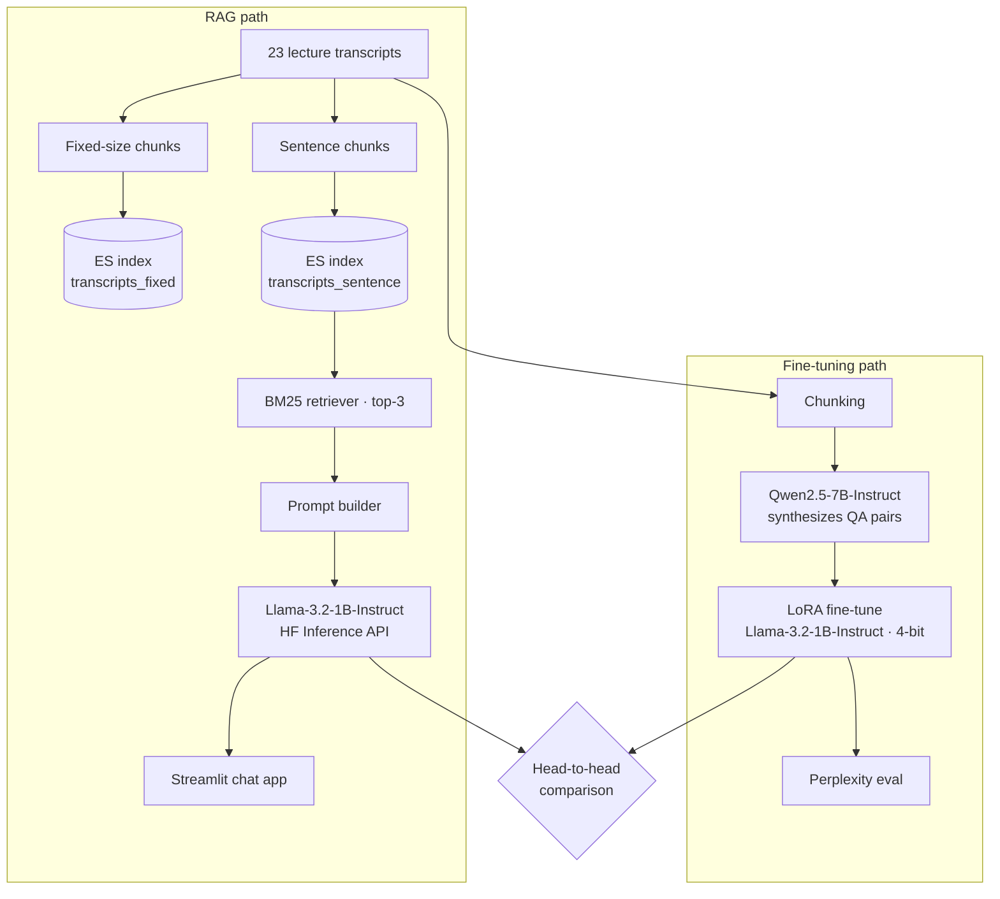

# LLM Fine-Tuning vs. Retrieval-Augmented Generation

Can a small (1B-parameter) LLM answer domain-specific questions better after **LoRA fine-tuning**, or when it's given **retrieved context**? This project builds both approaches over a corpus of 23 lecture transcripts on data management (SQL, MongoDB, Elasticsearch, Docker, deployment) and compares them head to head.

## Architecture



## What's inside

1. **Baseline behavior**: loads `Llama-3.2-1B-Instruct` in 4-bit (bitsandbytes), probes where it hallucinates, and steers it with chat templates and system roles.
2. **Synthetic training data**: `Qwen2.5-7B-Instruct` works as a teacher model and turns cleaned transcript chunks into exam-style question/answer pairs.
3. **LoRA fine-tuning**: a parameter-efficient fine-tune of the quantized 1B model on those pairs (PEFT + TRL), evaluated qualitatively and with held-out perplexity.
4. **RAG with Haystack + Elasticsearch**: transcripts are indexed twice (fixed-size vs. sentence-level chunks), and the two strategies are compared on hand-labeled Precision@3.
5. **Streamlit app**: a chat UI over the RAG pipeline that shows the retrieved chunks and their BM25 scores.
6. **Fine-tuning vs. RAG**: the same prompts go through both systems.

## Results

| Experiment | Result |
| --- | --- |
| Held-out perplexity, base → LoRA fine-tuned | **48.85 → 2.49** (−94.9%) |
| Retrieval Precision@3, fixed-size vs. sentence-level chunks | 0.40 vs. **0.87** |
| Factual accuracy on domain questions | **RAG** beat fine-tuning; the fine-tuned model still hallucinated specifics |

The takeaway: fine-tuning taught the model the *style and vocabulary* of the domain (hence the big perplexity drop), but grounding answers in retrieved text is what made them *correct*. Sentence-level chunks keep each passage on a single topic, so BM25's keyword matching lands on relevant text far more often.

## Tech stack

PyTorch · Hugging Face Transformers · PEFT (LoRA) · TRL · bitsandbytes (4-bit) · Datasets · Haystack · Elasticsearch (Elastic Cloud) · Hugging Face Inference API · Streamlit · NLTK

## Running it

The notebook targets Google Colab:

- **Sections 1–2** (inference and fine-tuning) need a T4 GPU; the free tier works.
- **Section 3** (RAG) runs on CPU.

```bash
pip install -r requirements.txt
jupyter lab llm_finetuning_vs_rag.ipynb
```

You'll be asked for:

- a **Hugging Face token** with access to the gated `meta-llama/Llama-3.2-1B-Instruct` model
- an **Elastic Cloud** Cloud ID and API key (the free trial works)

Credentials are read interactively with `getpass`, and the Streamlit app reads them from environment variables (`ES_CLOUD_ID`, `ES_API_KEY`). Nothing is stored in the notebook.

**Data:** the transcript corpus isn't redistributed. To reproduce the pipeline, point it at any folder of `.txt` transcripts; the loader expects files named like `12 en-English-SQL window functions.txt`.
